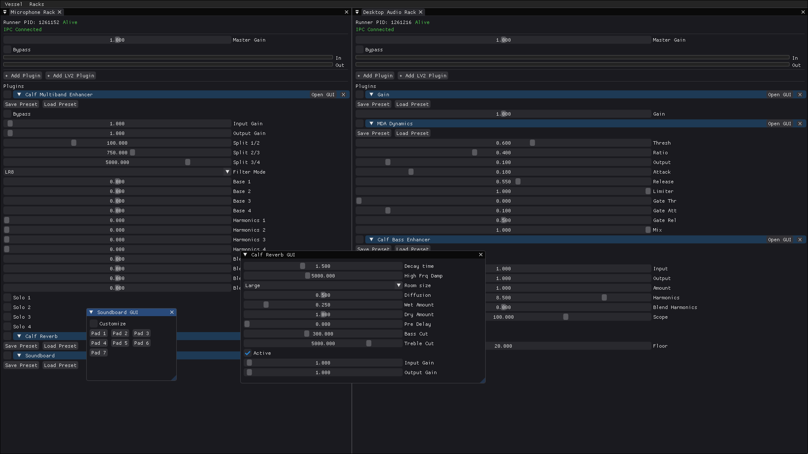

# Vessel

Vessel is a Linux audio plugin host built around PipeWire.

It uses a split architecture:
- `vessel-ui`: a Dear ImGui desktop app for rack and plugin control.
- `vessel-runner`: a headless real-time audio engine process (one per rack).

The UI talks to runners over Unix sockets, while each runner appears as a PipeWire filter node in your graph.


*Screenshot of Vessel UI with two racks and some random LV2 plugins loaded, as well as a few built-in plugins (Gain, Soundboard).*

## Contributing & Usage
This project is licensed under MIT. If you use this code in your own project 
or build a plugin for it, I'd love to hear about it! 
Feel free to open an issue or send me a message just to say hi and show off 
what you're building.

## Highlights

- Multi-rack hosting, with one isolated runner process per rack.
- Built-in DSP plugins:
	- Sine Mixer (Test)
	- Gain
	- Soft Clip
	- Soundboard (sample-trigger pads with load/rename/remove controls)
- LV2 plugin discovery and hosting.
- Live plugin parameter control from host UI.
- LV2 parameter typing support (float, int, bool, enum).
- Enum parameters rendered as labeled dropdowns when scale points exist.
- Plugin reorder by drag-and-drop.
- Rack and per-plugin bypass controls.
- Peak metering (input/output).
- Rack save/load (`.vrk`) and plugin preset save/load (`.vsp`).
- Optional plugin native/custom UI open/close support (when available).

## Architecture

Vessel separates UI and DSP into different processes.

- The UI launches `vessel-runner --id <rack_id>` for each rack.
- Each runner:
	- creates a PipeWire filter node named `vessel-rack-<id>`
	- processes audio in a real-time callback
	- hosts the plugin chain for that rack
- UI <-> runner communication uses a compact binary IPC protocol over a Unix domain socket at:

`/tmp/vessel-rack-<id>.sock`

This keeps UI responsiveness and audio processing loosely coupled.

## Requirements

### Runtime

- Linux
- PipeWire
- LV2 ecosystem (for LV2 plugins)

### Build dependencies

- CMake (3.15+)
- C++17 compiler
- `glfw3`
- `libpipewire-0.3`
- `libspa-0.2`
- `lilv-0`
- `suil-0`
- `sndfile`

ImGui (docking branch) is fetched automatically via CMake `FetchContent`.

Optional file-picker helpers used by the UI:
- `zenity` (preferred)
- `kdialog` (fallback)

## Build

```bash
cmake -S . -B build -G Ninja
cmake --build build
```

Built binaries:
- `build/vessel-ui`
- `build/vessel-runner`

There is also a legacy target alias `vessel` that maps to `vessel-ui`.

## Run

```bash
./build/vessel-ui
```

The UI starts with a `Main Rack` and launches one runner for it.

## Audio Routing (PipeWire)

Vessel currently appears as PipeWire nodes and is typically patched using a graph tool such as Helvum or qpwgraph.

For rack `1`, ports are exposed as:
- `vessel-rack-1:input_FL`
- `vessel-rack-1:input_FR`
- `vessel-rack-1:output_FL`
- `vessel-rack-1:output_FR`

You can connect sources and sinks manually in your graph manager, or use `pw-link`.

Example commands (names vary by system):

```bash
pw-link "system:capture_FL" "vessel-rack-1:input_FL"
pw-link "system:capture_FR" "vessel-rack-1:input_FR"
pw-link "vessel-rack-1:output_FL" "system:playback_FL"
pw-link "vessel-rack-1:output_FR" "system:playback_FR"
```

## Usage

1. Launch `vessel-ui`.
2. In a rack window:
	 - Set `Master Gain` and rack `Bypass`.
	 - Add built-in plugins with `+ Add Plugin`.
	 - Add LV2 plugins with `+ Add LV2 Plugin`.
3. Expand plugins to edit parameters.
4. Drag plugin headers to reorder processing order.
5. Use `Open GUI` / `Close GUI` on plugins that expose custom UIs.
6. Right-click rack window for rack actions:
	 - Save Rack to File
	 - Load Rack from File
	 - Rename Rack
	 - Delete Rack
7. Use per-plugin `Save Preset` / `Load Preset` for `.vsp` files.

## File Formats

- Rack snapshots: `.vrk`
- Plugin presets: `.vsp`

Current format versions in code:
- Rack: `VSRK2`
- Preset: `VSPT2`

These include plugin identity, parameter values, and plugin-defined state key/value data.

## LV2 Support Notes

- Discovery filters to plugins with at least one audio input and one audio output port.
- Control input ports are exposed as host parameters.
- LV2 port properties map to host parameter behavior:
	- `toggled` # Vessel: System Architecture & Technical Design

This document outlines the architectural strategy for **Vessel**, a low-latency audio plugin host designed for Arch Linux. It details the transition from a monolithic GUI to a distributed, multi-executable system optimized for performance and reliability.

## 1. The Multi-Executable Architecture

Vessel follows a **"Manager-Worker"** pattern. The system is split into two distinct roles: **The Orchestrator (GUI)** and **The Runners (Audio Hosts)**. This ensures that high-priority audio processing is never interrupted by UI rendering or user input latency.

### A. Vessel-UI (The Controller)
* **Technology:** C++, Dear ImGui (Docking Branch), GLFW.
* **Responsibility:** Visualizing rack state, managing plugin drag-and-drop, and providing a front-end for PipeWire routing.
* **Lifecycle Management:** Spawns a new `vessel-runner` process whenever a user adds a rack. It monitors these child processes and handles Inter-Process Communication (IPC).

### B. Vessel-Runner (The DSP Engine)
* **Technology:** C++, libpipewire, spa (Simple Plugin API).
* **Responsibility:** Maintaining a single real-time PipeWire filter. It runs headless and executes the actual audio processing loop.
* **Performance:** Runs with RT (Real-Time) priority. It is designed to be lean, with zero memory allocations in the processing callback.

---

## 2. The "Black Box" Audio Strategy

In PipeWire, we represent each Rack as a single, atomic node. This is the **Black Box Approach**. Instead of exposing every plugin as a separate node in the system graph, the Runner handles them internally.

* **Cache Locality:** Audio buffers stay in the CPU cache as they pass from plugin to plugin.
* **Reduced Context Switching:** The kernel only needs to schedule one process per rack, rather than dozens of individual plugin nodes.
* **Determinism:** The order of processing is explicitly defined by the internal C++ vector, preventing unpredictable graph traversal.

### Internal Processing Flow
The `on_process` callback in the Runner receives a buffer from PipeWire. It then iterates through an internal list of loaded plugins (LV2, C Alloy, or built-in DSP):

`Buffer In` $\rightarrow$ `Plugin 1` $\rightarrow$ `Plugin 2` $\rightarrow$ `...` $\rightarrow$ `Plugin N` $\rightarrow$ `Buffer Out`

---

## 3. Inter-Process Communication (IPC)

Communication between the GUI and the Runners is split into two channels to optimize for speed and reliability.

### Control Channel (Unix Domain Sockets)
Used for discrete events. When a user moves a slider or toggles a bypass, the GUI sends a small binary packet to the specific Runner's socket.
* `SET_PARAM [plugin_id] [value]`
* `LOAD_PLUGIN [uri]`
* `BYPASS_RACK [bool]`

### Telemetry Channel (Shared Memory / SHM)
Used for high-frequency data like audio meters. Sending socket messages 60 times a second for every rack is inefficient. 
* The **Runner** writes the current `Peak Level` to a shared memory segment.
* The **GUI** reads this value whenever it renders a frame to update the `ImGui::ProgressBar`.

---

## 4. Fault Tolerance & Sandboxing

By utilizing this multi-process structure, Vessel achieves a level of stability impossible in monolithic hosts:

1.  **Plugin Isolation:** A segfault in a custom-coded C Alloy plugin only kills the `vessel-runner` process for that rack. Other racks and the GUI stay alive.
2.  **UI Responsiveness:** Even if the audio engine is under heavy load (100% RT CPU), the GUI remains fluid because it is a separate process scheduled differently by the Linux kernel.
3.  **Hot Reloading:** The GUI can tell a Runner to restart or reload its DSP logic (useful for development) without needing to restart the entire application.

---

## 5. Development Roadmap
* [ ] Implement Unix Domain Socket bridge.
* [ ] Create headless `vessel-runner` template.
* [ ] Integrate `shmget`/`shmat` for cross-process metering.
* [ ] Add dynamic `pw-link` orchestration within the GUI manager.

---

## 6. Current Source Layout (Transition Snapshot)

The repository now follows the initial split architecture:

* `src/gui/main.cpp` builds `vessel-ui` (orchestrator process with ImGui + GLFW).
* `src/rackhost/main.cpp` builds `vessel-runner` (headless PipeWire rack host).

Current behavior during this transition:

* `vessel-ui` spawns one `vessel-runner` process per rack and monitors lifecycle (PID/alive state).
* Rack input/output linking is still done through `pw-link` commands from the UI.
* IPC control socket and SHM telemetry are intentionally stubbed as TODO while the executable split stabilizes.-> boolean checkbox
	- `integer` -> integer control
	- `enumeration` -> enum dropdown (with scale-point labels)
	- `port-props:logarithmic` -> logarithmic slider hint (float params)
- For plugin UIs, host currently prefers Qt5 UI, then X11 UI when supported by Suil.

## Current Limitations

- In active development; stability work is ongoing.
- MIDI input/output support is not implemented yet.
- Audio behavior across more sample rates, buffer sizes, and channel configurations is still being improved.
- LV2 hosting currently uses a single discovered audio input port and output port per channel path.

## Project Layout

```text
src/
	common/
		protocol.h          # IPC message protocol
		plugins.h           # Shared built-in plugin manifest
	gui/
		main.cpp            # vessel-ui (ImGui + GLFW controller)
	rackhost/
		main.cpp            # vessel-runner process + PipeWire + IPC server
		plugins_runtime.cpp # Built-in plugins + LV2 runtime adapter
		plugins_runtime.h
```

## Status

Vessel is usable as an experimental PipeWire plugin host and rack workflow prototype, with a focus on low-latency Linux desktop workflows.

## Third-Party Software

Vessel is made possible by these great open-source projects:
* **Dear ImGui** - UI layout and widgets.
* **PipeWire & libspa** - Low-latency audio infrastructure.
* **Lilv & Suil** - LV2 plugin discovery and UI hosting.
* **GLFW & GLAD** - Window management and OpenGL loading.

## License

This project is licensed under the **MIT License**. 

If you use Vessel in your own project, integrate the runner into your workflow, or build custom plugins for it, I'd love to hear about it! Open an issue or reach out—I'm always interested in seeing how people use the rack architecture.